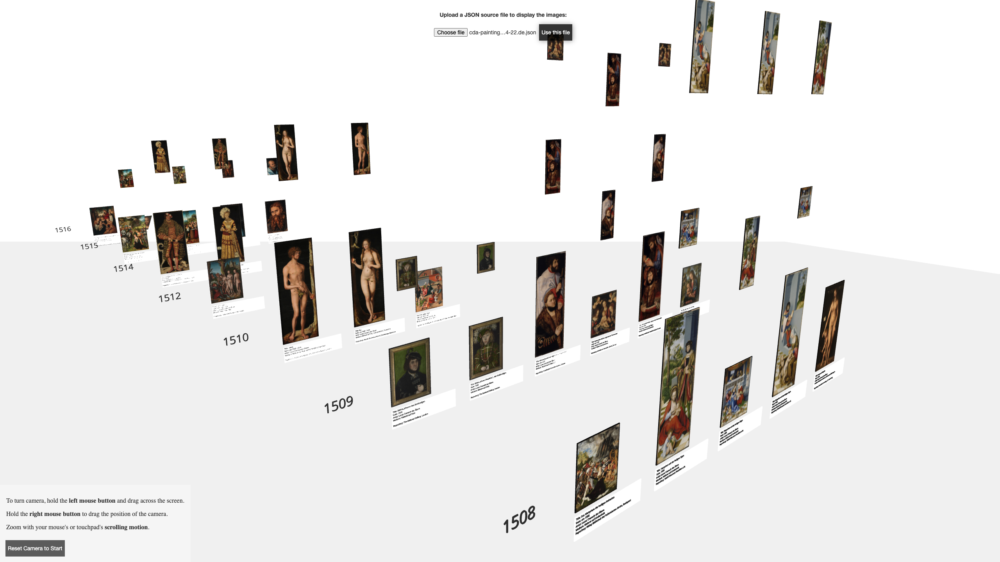

# Web Technologien // begleitendes Projekt Sommersemester 2022

"Zum Modul Web Technologien gibt es ein begleitendes Projekt. Im Rahmen dieses Projekts werden wir von Veranstaltung zu Veranstaltung ein Projekt sukzessive weiter entwickeln und uns im Rahmen der Veranstaltung den Fortschritt anschauen, Code Reviews machen und Entwicklungsschritte vorstellen und diskutieren.

Als organisatorischen Rahmen für das Projekt nutzen wir GitHub Classroom. Inhaltlich befassen wir uns mit der Entwicklung einer kleinen Web-Anwendung für die Bearbeitung von Bildern. Hierbei steht weniger ein professioneller Konzeptions-, Entwurfs- und Entwicklungsprozess im Vordergrund, sondern vielmehr die sukzessive Weiterentwicklung einer Anwendung, das Ausprobieren, Vergleichen, Refactoren und die Freude an lauffähigem Code."

- Description taken from the [MI Master WT Beiboot base project](https://github.com/mi-classroom/mi-master-wt-beiboot-2022).

## Live Demo

Um die live Demo zu sehen einfach https://mi-classroom.github.io/mi-web-technologien-beiboot-ss2022-Vorlova/ besuchen und die passende json Datei hochladen.


## Developing

Start a development server:

```bash
npm run dev

# or start the server and open the app in a new browser tab
npm run dev -- --open
```

### Building

To create a static build of the app:

```bash
npm run work-build
```

More details can be found in the [Deployment Workflow Documentation](docs/03a-Deployment-Workflow.md).

## Start with Docker

To start a Docker container with the application, use the following:

```bash
docker-compose up
```

Add a ``-d`` or ``--detached`` if desired.

To rebuild and start the container, use:

```bash
docker-compose up --build
```

## Documentation of Issues

The full documentation of each issue done in this project can be read [here](docs/00-Issue-Documentation.md).

The Reviews were conducted as depicted [here](docs/04a-Code-Review-Flow.md).

Deployments of current versions were done [like this](docs/03a-Deployment-Workflow.md).
