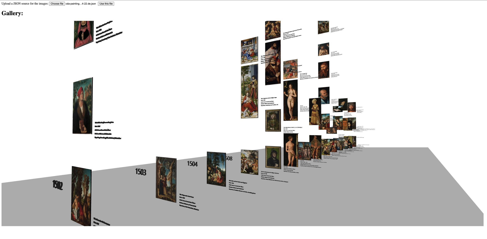
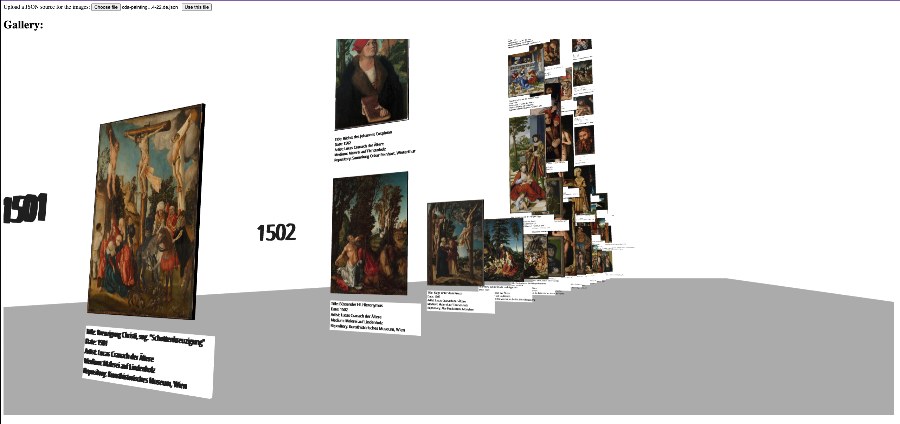
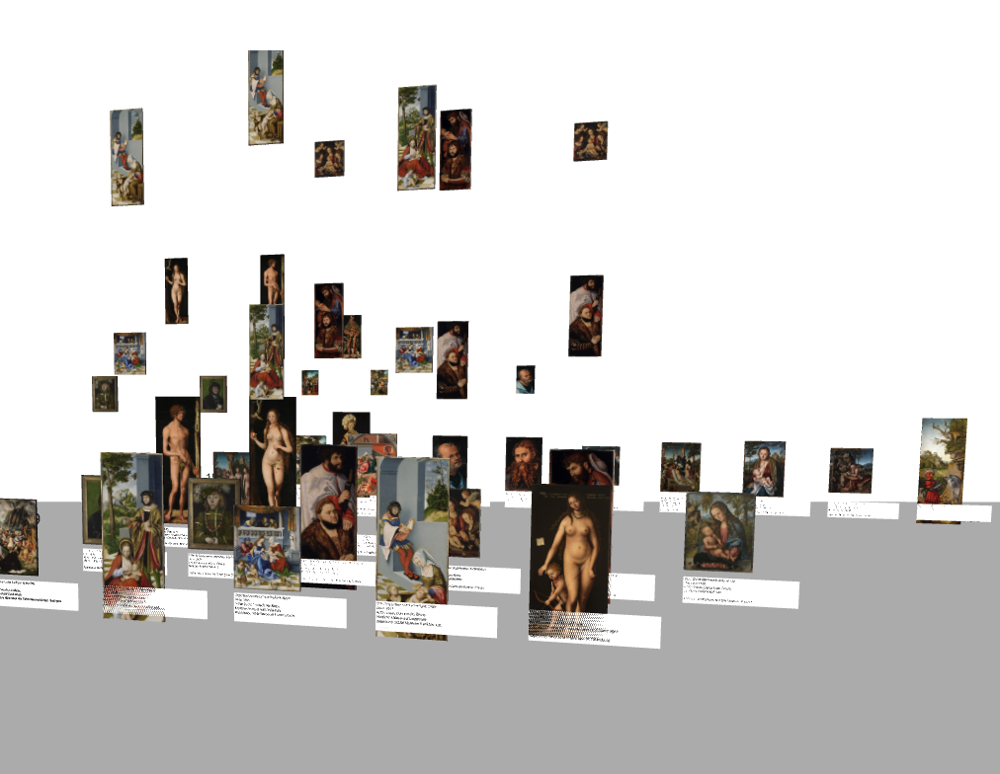
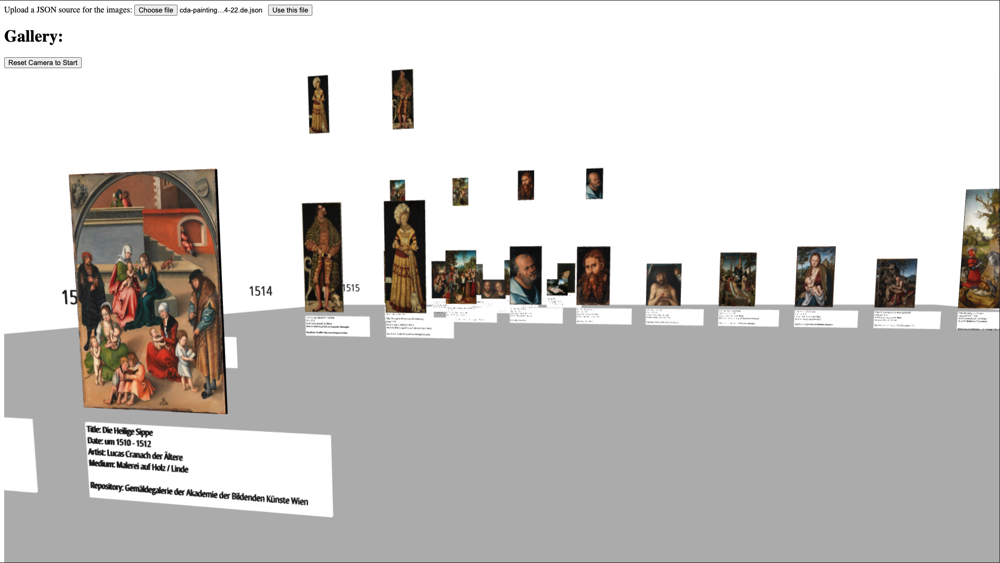
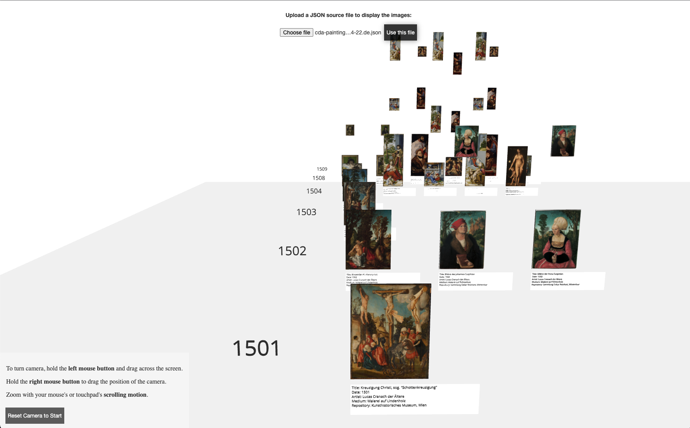

# Issue Documentation

## Issue 1:

### Criteria:

* [X] Overview of all paintings, which are labeled isBestOf, along with Preview, Title, Date, Type of work and Owner

* [X] Sorting of images along the sortingNumber

* [X] Deployment of the application beyond localhost (e.g. **GitHub Pages**, ADV Lab Server etc.)

* [ ] Simple access restriction via `.htaccess`

    * wasn't possible due to GitHub Pages solely hosting static pages.

    * a workaround was not established due to no sensitive information being live

* [X] JSON data may not be part of the repository

[Link to Issue 1](https://github.com/mi-classroom/mi-master-wt-beiboot-2022/issues/1#issue-1213671361)

## Issue 2:

### Criteria:

* [X] Establish a workflow with assigned Review Buddy

* [X] Configure repository according to review workflow

* [X] Application can be run via Docker

[Link to Issue 2](https://github.com/mi-classroom/mi-master-wt-beiboot-2022/issues/2#issue-1231133970)

## Issue 3:

### Criteria:

* [X] Display images in a 3D environment

* [X] add timeline on z-axis

* [X] Display relevant image information:
    
    * Image
    * Title
    * Artist (InvolvedPersons[0].name)
    * Type of work: medium (remove contents in brackets)
    * Owner: repository

Results:

Version 1: 
Version 2: 

[Link to Issue 3](https://github.com/mi-classroom/mi-master-wt-beiboot-2022/issues/3#issue-1246198869)

## Issue 4:

### Criteria:

* [X] Show related, similar, belongig paintings and images of the same work

* [ ] provide a clickable link to the images within the CDA

    * Due to inability to make meshes within the canvas clickable and seemingly no way of getting the current camera position, this feature could not be implemented in a user friendly way with *Svelte Cubed*.
    * Since abandoning *Svelte Cubed* in favor of the framework it is wrapping – *Three.js* – would likely lead to similar results as seen in other current repositories for this project which are using *Three.js*, the architecture was kept as it was.
    * Should the Project be continued, a change of frameworks is recommended, if no useful update is provided by then.

Results:

Version 3.1: 
Version 3.2: 

[Link to Issue 4](https://github.com/mi-classroom/mi-master-wt-beiboot-2022/issues/4#issue-1270561488)

## Issue 5:

### Criteria:

* [X] Overall improvements of the general image discovery experience

    + Improved UI
    + Reset Camera to start of timeline
    + provide a controls legend
    + ~~Add a loading indicator~~
        
        * was neither able to use the store in a helpful way nor the local variables to update the progress within the `forEach` loop.

Final Result:

Version 4: 

[Link to Issue 5](https://github.com/mi-classroom/mi-master-wt-beiboot-2022/issues/5#issue-1270965839)